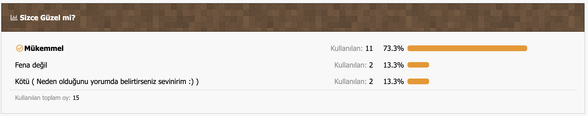
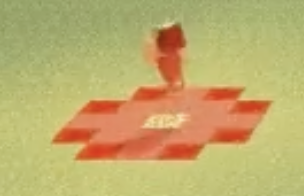

## Geliştirici Notu (Kişisel Arşiv)

> Bu eklentiyi yazdığımda (2014) henüz **13 yaşındaydım** (2001 doğumluyum). O zamanlar Java'yı ve kodlamayı yeni keşfediyordum, tamamen eğlence amaçlı ve arkadaş ortamında gülmek için böyle bir proje ortaya çıkarmıştım.

> Bugün geriye dönüp baktığımda kodlar çok acemice ve basit görünebilir; ancak bu proje benim için o dönemki Minecraft sunucu günlerimden ve çocukluğumdan kalan kıymetli bir hatıradır.

# Lanet Plugini (v1.0 - 2014 Arşivi)

Bu depo, 2014 yılında bir Minecraft Forumunda tarafımca geliştirilip paylaşılan ve dönemin sunucularında eğlence amaçlı kullanılan "Lanet Plugini"nin korunmuş orijinal kodlarını içerir.

---

## Oylama Sonuçları (2014)

Bu eklenti yayınlandığında forum üyeleri tarafından yapılan oylamanın orijinal sonuçlarıdır. Topluluğun eklentiye verdiği tepkiyi (ve mizahı) yansıtır.

## Lanet Deseni (Görsel)

Oyuncu hareket ettiğinde ayaklarının altında oluşan desenin şeması şöyledir:
* **Merkez:** Glowstone (Işıktaşı)
* **Yanlar:** Redstone Block (Kızıltaş Bloğu)
* **Köşeler:** Netherrack

Aşağıdaki resim benzer olduğu için konmuştur konsept olarak, eklentiye ait resim elimde yok ama yaklaşık bu şekilde gözüküyor 3x3 olarak. Kod düzenlenerek istenilen görüntüye ulaşılabilir.

---

## Nedir Bu Eklenti?

Lanet Plugini, sunucudaki bir oyuncuyu hedef alarak onu "lanetlemenizi" sağlar.

* **Mekanik:** `/lanetle <isim>` komutu kullanıldığında hedef oyuncu işaretlenir.
* **Sonuç:** Oyuncu her hareket ettiğinde bastığı ve çevresindeki 3x3'lük alan anlık olarak **Netherrack, Kızıltaş ve Işıktaşına** dönüşür.
* **Döngü:** Oyuncu ilerledikçe arkasındaki bloklar eski haline döner, ancak lanet onu takip etmeye devam eder.

## Kurulum

Eklenti **1.7.x** sürümleri için yazılmıştır.

1. `.jar` dosyasını `plugins` klasörüne atın.
2. Sunucuyu başlatın.
3. `/lanetle <oyuncu_adi>` komutunu kullanın.
4. Oyuncunun altının değişmesini izleyin.

## Arşiv Notu
Kodlar eğitim, eğlence ve arşiv amaçlı saklanmıştır.

> **Ufak Bir Eksik:** Kodlarda değişkenler "global" tanımlandığı için (13 yaşındaki acemilik), sunucuda aynı anda birden fazla kişiyi lanetlerseniz bloklar birbirine karışacaktır. Aynı anda sadece tek kişi üzerinde kullanılması önerilir!
